# 重邮课表 (CQUPT Schedule)

一款为重邮学子打造的高颜值、功能强大的课表 App。基于 Flutter 开发，支持 Android & iOS 双平台。

__请加入 QQ 群 1051832310，获取 TestFlight 测试资格，以下载 iOS 版本 APP。__

## 🌟 核心特性

-   **🎨 极致颜值**：支持毛玻璃效果、自定义背景图片、课程块颜色深度定制。
-   **📅 功能完备**：自动拉取教务系统课表，支持手动添加自定义行程。
-   **🔗 系统整合**：支持导出至系统日历，开启上课自动提醒。
-   **📱 全方位触达**：
    -   **桌面小组件**：多种尺寸，随时查看下一节课。
    -   **锁屏小组件**：抬手即看，实时显示课程进度与倒计时。
    -   **iOS 快捷指令**：深度集成，支持语音查询与自动化逻辑。
-   **🌓 灵活配置**：丰富的主题设置，包括字体颜色、描边、不透明度等。

## 📸 界面预览

### 🏠 登录与课表主页
| 登录界面 | 课表 (默认背景) | 课表 (自定义背景) |
| :---: | :---: | :---: |
| 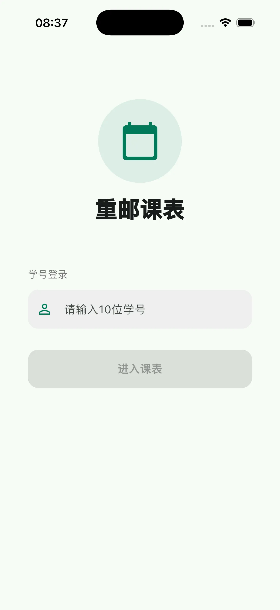 | 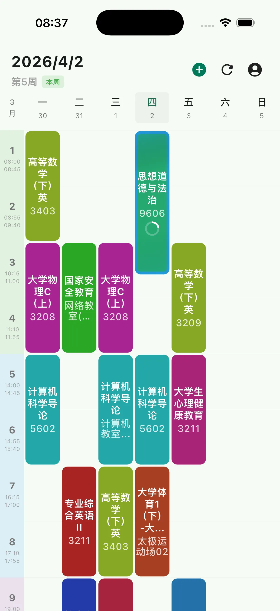 | 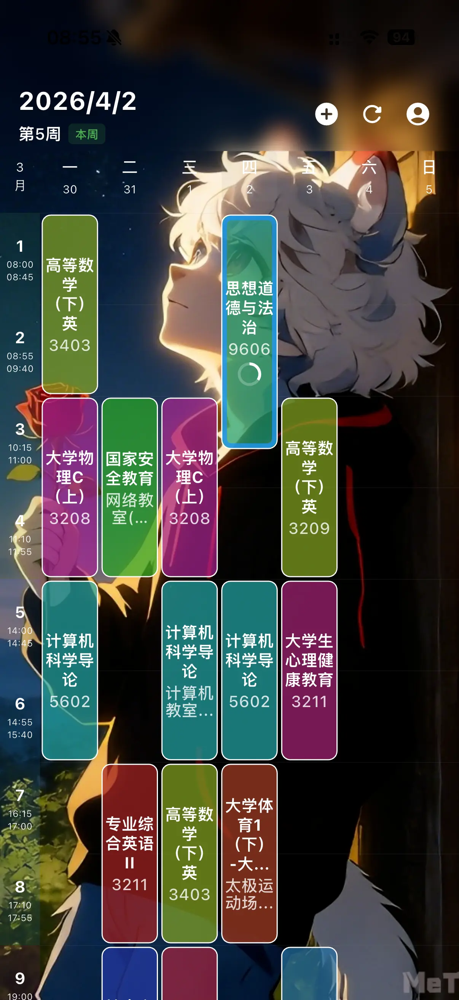 |

### 📚 课程管理
| 课程详情 | 颜色管理 | 调色盘 |
| :---: | :---: | :---: |
| 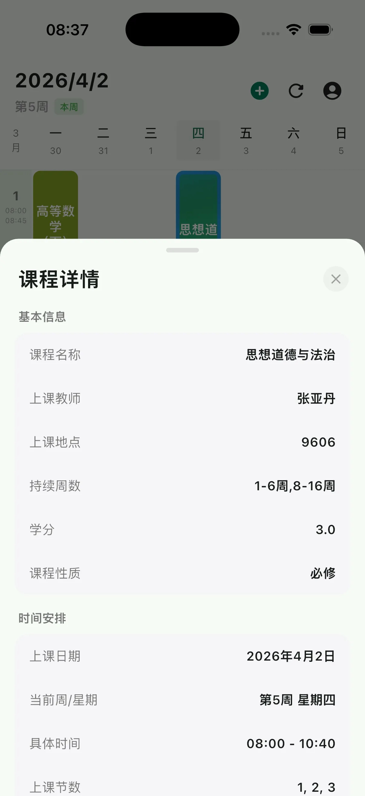 | 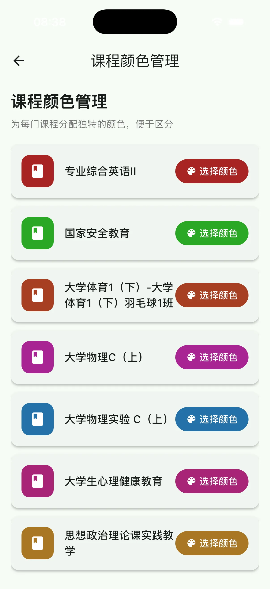 | 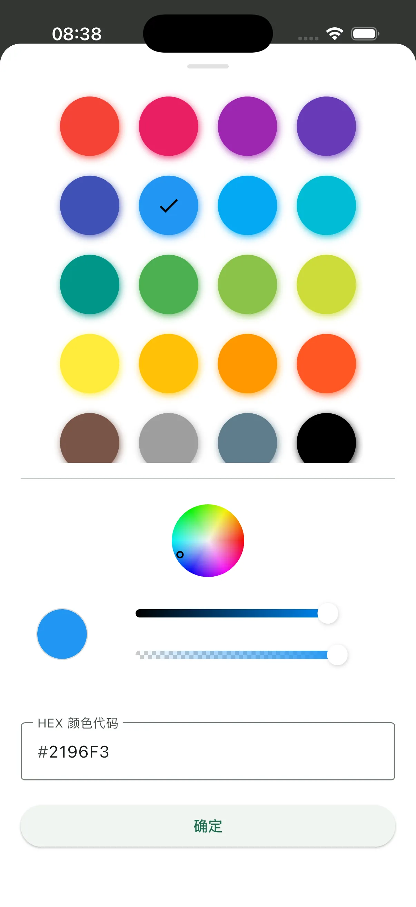 |

### 🛠️ 个性化设置
| 功能入口 | 主题设置 (1) | 主题设置 (2) |
| :---: | :---: | :---: |
| 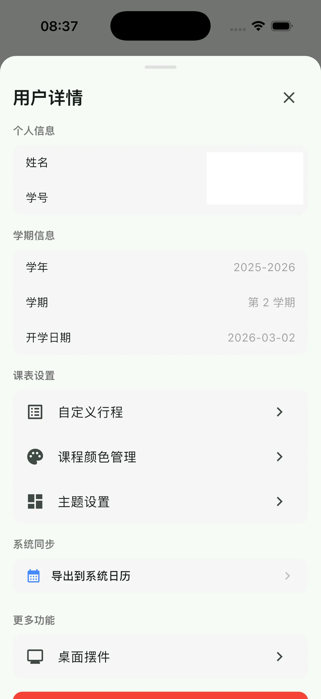 | 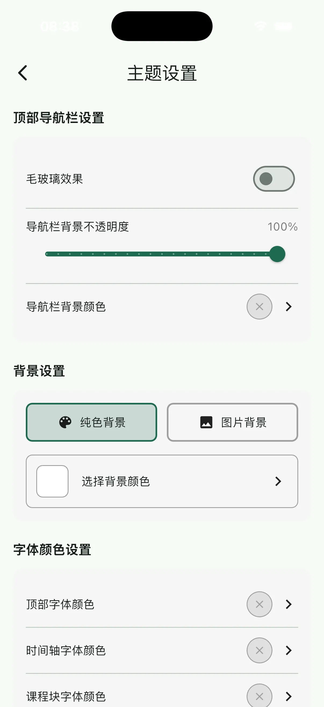 | 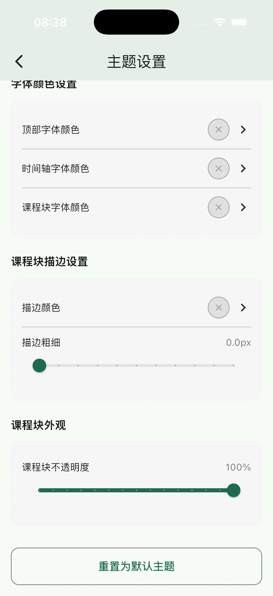 |

### ✏️ 自定义行程
| 自定义列表 | 添加行程 |
| :---: | :---: |
| 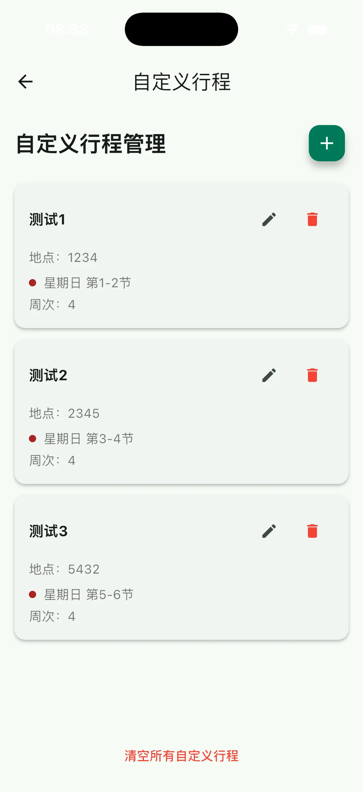 | 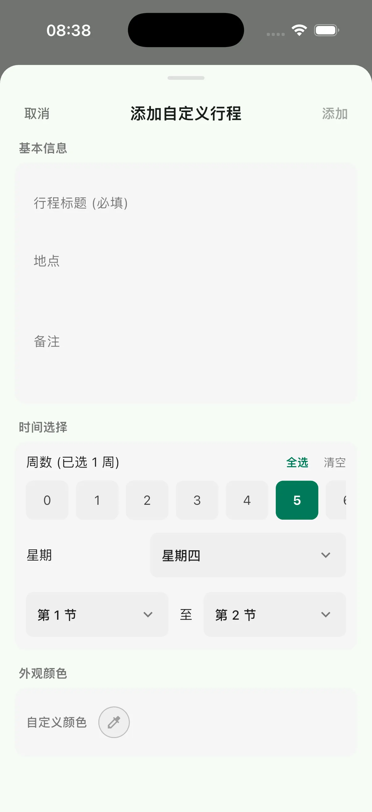 |

### 🧩 组件与实时活动
| 桌面组件 | 桌面摆件 | 锁屏组件 |
| :---: | :---: | :---: |
| 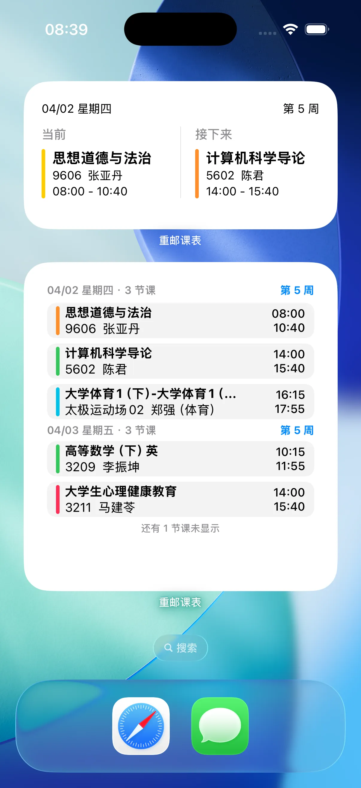 | 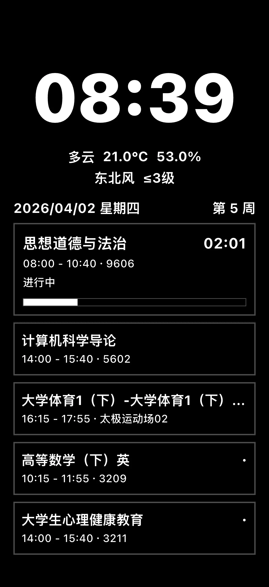 | 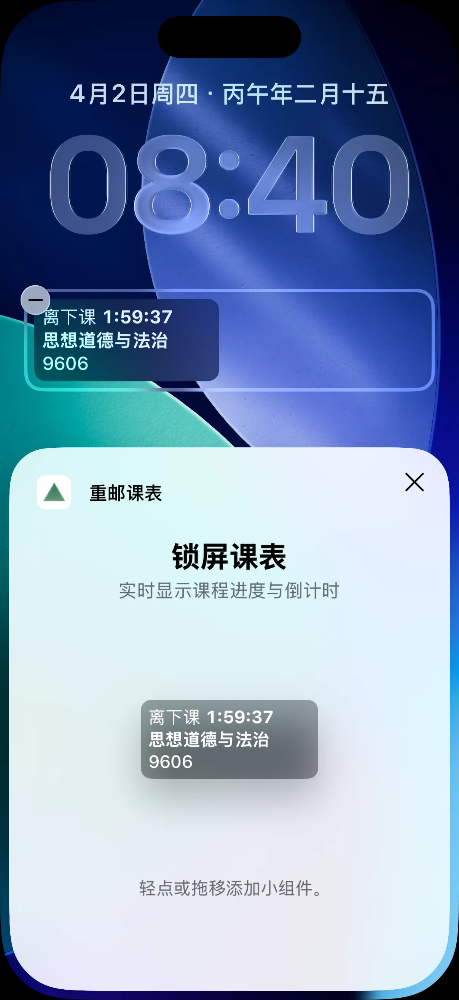 |

### 🚀 效率工具
| 日历同步 | 快捷指令 | 查询结果 |
| :---: | :---: | :---: |
| 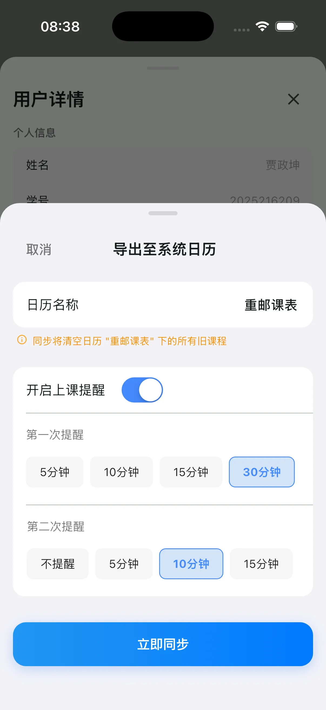 | 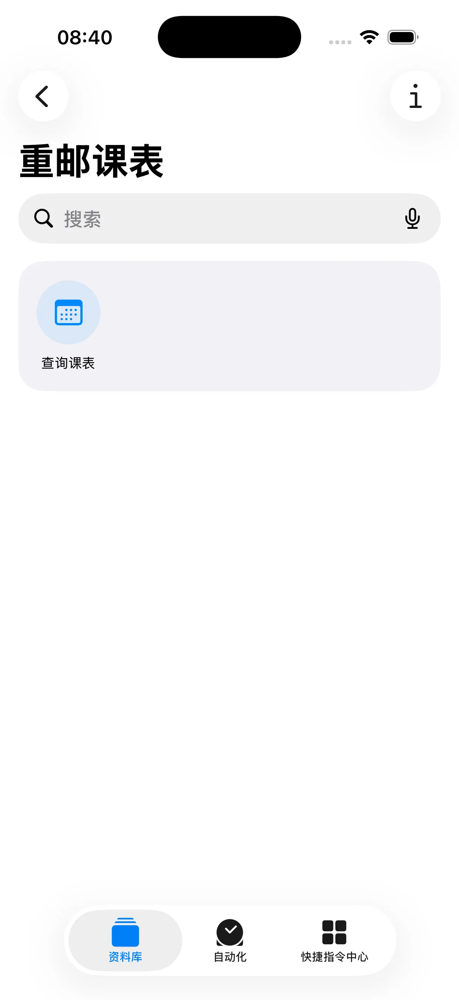 | 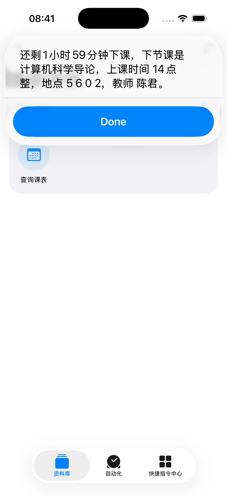 |

## 🚀 快速开始

本项目是一个 Flutter 应用程序。

1.  **安装 Flutter 环境**：请参考 [Flutter 官网](https://docs.flutter.dev/get-started/install)。
2.  **获取代码**：`git clone https://github.com/MeTerminator/cqupt-schedule-app.git`
3.  **运行项目**：
    ```bash
    flutter pub get
    flutter run
    ```


## 💬 反馈与交流 

欢迎加入反馈 QQ 群：**1051832310**

---

Made with ❤️ by MeTerminator
